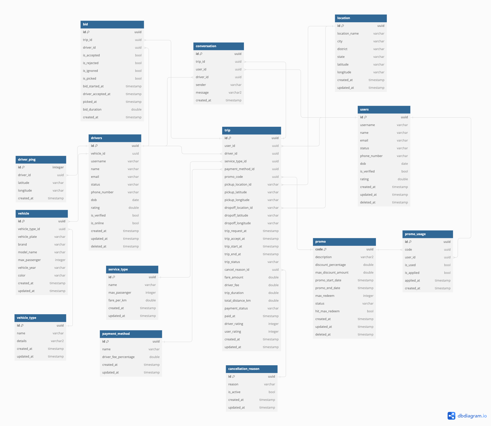
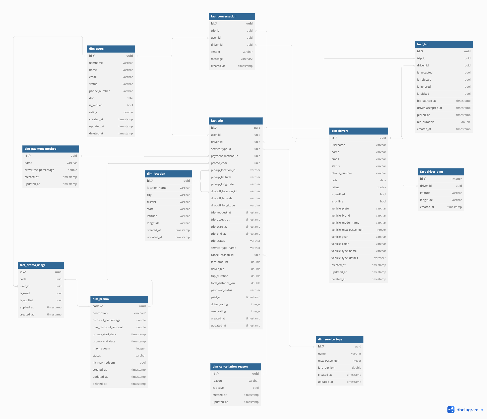

# Data Engineering Test - Demsy Iman M

Hello! First of all, thank you so much for the opportunity for allowing me to do this first stage of the interview. I've put all of my answers below, including the explanation, images, etc. Hopefully my answers will satisfy the requirements!

## Setup
1. Create a virtual environment, so that my solution won't break you local. Use any of your preferred virtualenv.
2. Activate your virtual environment.
3. Install all dependencies:
```pip install -r requirements.txt```
4. You're good to go.
#
# Part 1: Data Schema Enforcement with PySpark

### Solution
#### Assumption
- Since I don't use any cloud platform, I use local files to store the data source, schema registry and result file
- For the output file, I append the incoming data to existing data, and store it to a file inside  `out` folder, because I don't use any DB

#### Relevant Files and Folders
```
.
├── data-source
│   ├── ride-request-existing.csv
│   └── ride-request.csv
├── out
│   └── raw_ride_ride_request
├── schema-registry
│   └── raw_ride_ride_request.json
├── src
│   ├── lib
│   │   └── utils.py
│   └── ride-request.py
└── test
    └── test_utils.py
```
- Each job/table will have it's own file under `src` folder. For example, `ride-request.py` is specifically for `ride_request` table. If there's another ETL job for a new table, you need to create a new file by copying existing file, but only needs to change several variables in it. So it's pretty simple to add a new job.
- All relevant functions live inside `src/lib/utils.py`
- For `schema-registry` folder, it stores all tables latest schemas. So, every time you create a new ETL job under `src` folder, the schema registry file will automatically be created during job execution. It has `dataset_tablename.json` format
- Inside `out` folder, it stores all output files for each job. The folders inside it will have `dataset_tablename` folder name.

#### Flowchart


#### Running the job
You can run the job, using `spark-submit` command.

    spark-submit src/ride-request.py

#
# Part 2: Data Quality with PySpark

### Solution
#### Assumption
- I'm using **Great Expectation** to do the data quality checks. I choose GX because: 
	- it supports Spark dataframe. So the data quality checks can be executed without storing the data to destination table first
	- It's easy to get the report in JSON format for further analysis
	- It supports complex data quality checks, and pretty customizable.
	- It provides data profiling
	- It's well documented, and the community is already big. So, looking for a solution is easy in the internet
	- Possible to do version control, because it's code based.
- For this test, I'm only using 3 common data quality metrics: `Data completeness, Uniqueness and Validty`
- To present the result report to other stakeholders, I prefer to store the test results to a DWH table, using the JSON test result. Then after that we can create our custom dashboards for data quality checks in any BI Tool, like Metabase, Tableau, Looker, etc.

#### Relevant Files and Folders
```
.
├── README.md
├── data-source
│   └── taxi-trip.csv
├── data_quality_test
│   ├── config
│   │   └── raw_ride_taxi_trip.json
│   ├── data_quality
│   │   ├── DataQuality.py
│   ├── dqc.py
│   └── expectation
│       ├── Expectation.py
│       ├── NotNullExpectation.py
│       ├── UniqueExpectation.py
│       └── ValuesInListExpectation.py
├── out
│   └── raw_ride_taxi_trip
├── schema-registry
│   └── raw_ride_taxi_trip.json
├── src
│   ├── lib
│   │   └── utils.py
│   └── taxi-trip.py
└── test
```
- I'm still using the same codes and structure as the first task.
- I assume that data quality check is optional. So, you can customize whether you want to add it to an ETL job or not.
- For this task, I'm using `taxi-trip` data, so the job file is **`taxi-trip.py`**. Inside that file, there's this block of code to run the data quality checks. If the `dqcheck` returns `TRUE`, then it'll continue to the next steps (update the schema registry and insert the data)
```python
	dqcheck = data_quality_checker(df, DATASET_NAME, TABLE_NAME)
	if dqcheck:
		updated_schema = update_schema_registry(DATASET_NAME, TABLE_NAME, new_schema)
		append_data_to_destination(DATASET_NAME, TABLE_NAME, df)
```
- For the data quality checks config, I put it inside `data_quality_test/config/` folder. That folder contains the test configuration files for every ETL job in JSON format. The file name follows `dataset_tablename` format.
- The list of `expectations` live under `data_quality_test/expectation` folder. Each expectation will have it's own file and class, for flexible configuration.
- For the report structure that will be showed at every job run, I use the structure below. Using that report, we can see which column that doesn't pass data quality test, how many rows that don't meet the expectation including the percentage.


#### Running the job
You can run the job, using `spark-submit` command.

    spark-submit src/taxi-trip.py


#
# Part 3: Data Modelling

### Solution
#### Assumption
- Here's the ERD that I assume a taxi service app will have in Application DB:


#### Data Model
I'm using **Kimball** approach to design the data models in the DWH. By using this approach, it'll allow easy understanding and faster query execution for analytics and reporting purpose. I grouped the models with `dim` and `fact` tables. So, fact tables will use dim tables as its references.


#### KPIs can be derived from proposed data model
##### 1. Daily Active Users (DAU)
```sql
select
  date_trunc(created_at, DAY) as date,
  count(distinct user_id) as user_ct
from fact_trip
group by 1
order by 1;
```
##### 2. Monthly Active Users (MAU)
```sql
select
  date_trunc(created_at, MONTH) as date,
  count(distinct user_id) as user_ct
from fact_trip
group by 1
order by 1;
```
##### 3. Monthly GMV
```sql
select
  date_trunc(created_at, MONTH) as date,
  sum(fare_amount) as gmv
from fact_trip
group by 1
order by 1;
```
##### 4. Monthly GMV per service type
```sql
select
  date_trunc(created_at, MONTH) as date,
  dst.name as service_type_name,
  sum(fare_amount) as gmv
from fact_trip ft
join dim_service_type dst on dst.id = ft.service_type_id
group by 1,2
order by 1,2;
```
##### 5. Frequently used destinations
```sql
with pickup as (
	select
		dl.id,
		count(ft.id) as ct
	from fact_trip ft
	left join dim_location dl on dl.id = ft.pickup_location_id
	where ft.trip_status = "completed"
	group by 1
)
, dropoff as (
	select
		dl.id,
		count(ft.id) as ct
	from fact_trip ft
	left join dim_location dl on dl.id = ft.dropoff_location_id
	where ft.trip_status = "completed"
	group by 1
)

select
	dl.id,
	dl.location_name, dl.city, dl.district, dl.state, dl.latitude, dl.longitude,
	coalesce(pickup.ct,0) + coalesce(dropoff.ct,0) as used_ct
from dim_location dl
left join pickup on pickup.id = dl.id
left join dropoff on dropoff.id = dl.id
order by 8 desc
```

##### 6. Promo usages
```sql
select
	fpu.code,
	dp.description,
	dp.max_redeem,
	dp.promo_start_date,
	dp.promo_end_date,
	count(fpu.id) as usage
from fact_promo_usage fpu
left join dim_promo dp on dp.code = fpu.code
where fpu.is_applied is true
group by 1,2,3,4,5
order by 6 desc
```

##### 7. Most frequently used cancel reason
```sql
select
	dcr.reason,
	count(ft.id) as reason_used
from fact_trip ft
join dim_cancellation_rason dcr on dcr.id = ft.cancel_reason_id
where ft.cancel_reason_id is not null
group by 1
```
##### 8. Most active drivers
```sql
select
	dd.id as driver_id,
	dd.name as driver_name,
	count(ft.id) as trip_count
from fact_trip ft
join dim_drivers dd on dd.id = ft.driver_id
where ft.status = "completed"
group by 1,2
order by 3 desc
```
##### 9. Weekly rolling GMV per service type
```sql
select 
	date_trunc(ft.created_at, WEEK) as date,
	dst.name,
	SUM(ft.fare_amount) OVER (ORDER BY date(ft.created_at) 
    RANGE BETWEEN 7 PRECEDING AND 1 PRECEDING) AS rolling_7_days_gmv  
FROM fact_trip ft
left join dim_service_type dst on dst.id = ft.service_type_id
group by 1,2
order by 1,2
```

##### 10. Peak Hours (last 1 year)
```sql
with hourly_trip as (
	select
		trip_start_at,
		DATETIME_TRUNC(trip_start_at, HOUR) as hour, 
		COUNT(*) AS trip_ct 
	FROM fact_trip
	where created_at >= DATE_SUB(date(created_at), INTERVAL 1 year)
	GROUP BY 1,2
)

select 
	hour,
	avg(trip_ct) as avg_trip
from hourly_trip
group by 1
order by 2 desc

```

## Running test
1. I'm using `pytest` for creating the unit test. So you can run this command to execute the unit test:
```
pytest  -s -vv -W ignore::DeprecationWarning
```
