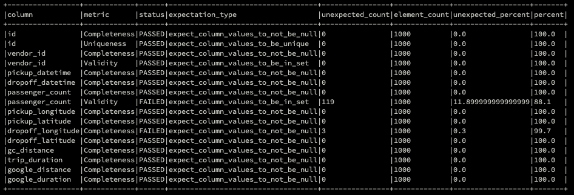

# Data Engineering Test - Demsy Iman M

Hello! First of all, thank you so much for the opportunity for allowing me to do this first stage of the interview. I've put all of my answers below, including the explanation, images, etc. Hopefully my answers will satisfy the requirements!

## Setup
1. Create a virtual environment, so that my solution won't break you local. Use any of your preferred virtualenv.
2. Activate your virtual environment.
3. Install all dependencies:
```pip install -r requirements.txt```
4. You're good to go.

# Part 1: Data Schema Enforcement with PySpark
### Task
Imagine, you are in an environment where applications are constantly evolving to meet market demands, schema
evolution becomes an inevitable aspect. As a Data team, we must be prepared to adapt to these changes.
Deliverables:
- Propose a design solution on how to manage this schema evolution situation dynamically on the data pipelines.
- Prepare a PySpark pipeline by implementing the proposed solution.

Use cases must be considered in the solution:
- Addition of new data fields in the existing schema of the source records
- Update of the data type of an existing field of the source record

### Solution
#### Assumption
- Since I don't use any cloud platform, I use local files to store the data source, schema registry and result file
- For the output file, I append the incoming data to existing data, and store it to a file inside  `out` folder, because I don't use any DB

#### Relevant Files and Folders
```
.
├── data-source
│   ├── ride-request-existing.csv
│   └── ride-request.csv
├── out
│   └── raw_ride_ride_request
├── schema-registry
│   └── raw_ride_ride_request.json
├── src
│   ├── lib
│   │   └── utils.py
│   └── ride-request.py
└── test
    └── test_utils.py
```
- Each job/table will have it's own file under `src` folder. For example, `ride-request.py` is specifically for `ride_request` table. If there's another ETL job for a new table, you need to create a new file by copying existing file, but only needs to change several variables in it. So it's pretty simple to add a new job.
- All relevant functions live inside `src/lib/utils.py`
- For `schema-registry` folder, it stores all tables latest schemas. So, every time you create a new ETL job under `src` folder, the schema registry file will automatically be created during job execution. It has `dataset_tablename.json` format
- Inside `out` folder, it stores all output files for each job. The folders inside it will have `dataset_tablename` folder name.

#### Flowchart


#### Running the job
You can run the job, using `spark-submit` command.

    spark-submit src/ride-request.py


# Part 2: Data Quality with PySpark
### Task
Ensuring the quality of data is crucial for any organization relying on data-driven decision-making. You are tasked with
preparing a report on data quality and profiling for the dataset after each run and sharing it with the leadership team.
Deliverables:
- Present a design solution utilizing any data quality framework and provide reasoning to support its selection.
- Develop a PySpark pipeline to implement the proposed solution and detail the structure of the quality report.

Assumption:
- You can choose any available open-source Data Quality frameworks which supports PySpark.
- You can choose your own data source.

### Solution
#### Assumption
- I'm using **Great Expectation** to do the data quality checks. I choose GX because: 
	- it supports Spark dataframe. So the data quality checks can be executed without storing the data to destination table first
	- It's easy to get the report in JSON format for further analysis
	- It supports complex data quality checks, and pretty customizable.
	- It provides data profiling
	- It's well documented, and the community is already big. So, looking for a solution is easy in the internet
	- Possible to do version control, because it's code based.
- For this test, I'm only using 3 common data quality metrics: `Data completeness, Uniqueness and Validty`
- To present the result report to other stakeholders, I prefer to store the test results to a DWH table, using the JSON test result. Then after that we can create our custom dashboards for data quality checks in any BI Tool, like Metabase, Tableau, Looker, etc.

#### Relevant Files and Folders
```
.
├── README.md
├── data-source
│   └── taxi-trip.csv
├── data_quality_test
│   ├── config
│   │   └── raw_ride_taxi_trip.json
│   ├── data_quality
│   │   ├── DataQuality.py
│   ├── dqc.py
│   └── expectation
│       ├── Expectation.py
│       ├── NotNullExpectation.py
│       ├── UniqueExpectation.py
│       └── ValuesInListExpectation.py
├── out
│   └── raw_ride_taxi_trip
├── schema-registry
│   └── raw_ride_taxi_trip.json
├── src
│   ├── lib
│   │   └── utils.py
│   └── taxi-trip.py
└── test
```
- I'm still using the same codes and structure as the first task.
- I assume that data quality check is optional. So, you can customize whether you want to add it to an ETL job or not.
- For this task, I'm using `taxi-trip` data, so the job file is **`taxi-trip.py`**. Inside that file, there's this block of code to run the data quality checks. If the `dqcheck` returns `TRUE`, then it'll continue to the next steps (update the schema registry and insert the data)
```
	dqcheck = data_quality_checker(df, DATASET_NAME, TABLE_NAME)
	if dqcheck:
		updated_schema = update_schema_registry(DATASET_NAME, TABLE_NAME, new_schema)
		append_data_to_destination(DATASET_NAME, TABLE_NAME, df)
```
- For the data quality checks config, I put it inside `data_quality_test/config/` folder. That folder contains the test configuration files for every ETL job in JSON format. The file name follows `dataset_tablename` format.
- The list of `expectations` live under `data_quality_test/expectation` folder. Each expectation will have it's own file and class, for flexible configuration.
- For the report structure that will be showed at every job run, I use the structure below. Using that report, we can see which column that doesn't pass data quality test, how many rows that don't meet the expectation including the percentage.
